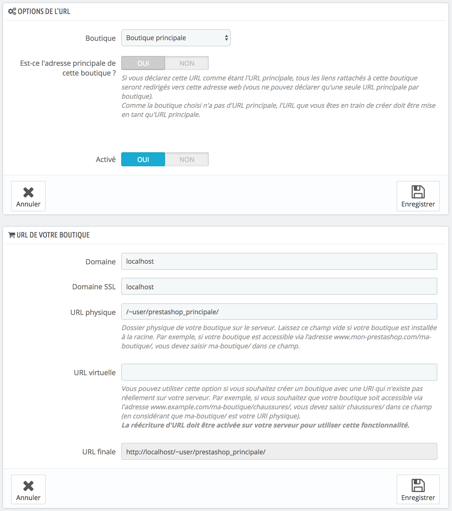

# Mettre en place l'URL d'une boutique

Chaque boutique peut avoir sa propre adresse – ou même plusieurs adresses – totalement indépendantes de la boutique principale \(qui est celle que vous avez installée en premier\). Vous devez définir au moins une adresse pour chaque boutique.

**Deux boutiques ne peuvent pas partager la même adresse**. Si vous essayez de donner à une boutique une adresse déjà utilisée par une autre boutique, PrestaShop affichera une erreur.   
D'un autre côté, vous pouvez avoir autant de boutiques que vous le souhaitez sur un même domaine :

* dans des sous-dossiers : [`http://www.example.com/hommes/`](http://www.example.com/hommes/), [`http://www.example.com/femmes/`](http://www.example.com/femmes/), [`http://www.example.com/enfants/`](http://www.example.com/enfants/), [`http://www.example.com/animaux/`](http://www.example.com/animaux/), etc.

  Dans le cas de boutiques dans des sous-dossiers, faites en sorte de créer deux URL pour chaque boutique : l'une avec le "www.", l'autre sans !

  Par exemple : [`http://www.example.com/hommes/`](http://www.example.com/hommes/) et [`http://example.com/hommes/`](http://example.com/hommes/)

  Sans quoi les clients qui tenteront d'accéder à une boutique seconde dans le "www." dans l'URL seront redirigés vers votre boutique principale.

* dans des sous-domaines : `http://hommes`.[example.com/](http://example.com/), `http://femmes`.[example.com/](http://example.com/), `http://enfants`.[example.com/](http://example.com/), `http://animaux`.[example.com/](http://example.com/), etc.  

Ne créez pas de sous-dossier ou de sous-domaine vous-mêmes, que ce soit sur votre serveur ou votre ordinateur : PrestaShop s'occupera de créer le chemin d'accès pour vous sur le serveur. Quand le client accèdera à ce chemin, PrestaShop reconnaîtra la boutique de destination et enverra les fichiers et données de cette boutique automatiquement.

Bien entendu, une boutique peut aussi avoir son propre nom de domaine.

Utiliser un nom de domaine

 Dans le cas où vous utilisez un nom de domaine différent pour votre boutique supplémentaire plutôt qu'un sous-domaine ou un sous-dossier, vous devez configurer votre domaine pour qu'il pointe vers le dossier dans lequel PrestaShop se trouve. PrestaShop s'occupera ensuite de la réécriture de l'adresse web.

Autrement, vous pouvez créer un alias pour votre nom de domaine qui renvoie vers l'adresse absolue de votre installation de PrestaShop. La manière dont vous pouvez le faire dépend du panneau de contrôle et des options qui vous sont proposées par votre hébergeur web : "Alias" pour Plesk, "Forward" pour CPanel, "Aliasdomain" pour ISPConfig, etc.

Pour ajouter une adresse à une boutique, sélectionnez la boutique dans le sélecteur "Arbre multiboutique", puis cliquez sur le bouton "Ajouter une nouvelle URL". PrestaShop chargera l'écran avec deux sections et huit options :

* **Options de l'URL**.
  * **Boutique**. Un rappel de la boutique à laquelle vous ajoutez une adresse. Vous pourriez également vouloir utiliser une autre boutique.
  * **URL principale**. En activant cette option, vous indiquez que vous voulez que toutes les autres adresses de cette boutique redirigent vers cette nouvelle adresse.
  * **État**. Vous pouvez désactiver et réactiver une adresse à n'importe quel moment.
* **URL de la boutique**.
  * **Domaine**. L'adresse elle-même. Elle n'a pas à se limiter au nom de domaine : vous pouvez indiquer un sous-domaine si vous en avez besoin. Exemple : [`www.example.com`](http://www.example.com) ou [`enfants.example.com`](http://enfants.example.com).
  * **Domaine SSL**. Si votre domaine SSL est différent du domaine principal, faites en sorte de bien l'indiquer dans ce champ. Exemple : [`www.example.com`](http://www.example.com) ou [`enfants.example.com`](http://enfants.example.com).
  * **URI physique**. Vous pouvez ici configurer le chemin physique de votre installation de PrestaShop sur votre serveur. Si votre boutique se trouve à la racine du domaine ou du sous-domaine, laissez ce champ vide. Exemple : `/` ou `/enfants/`.
  * **URL virtuelle**. Vous pouvez rendre la boutique disponible à vos clients de manière transparente à l'aide de cette option : sans devoir créer de sous-dossier, vous pouvez faire en sorte que la boutique soit affichée, grâce à la réécriture d'URL. Bien entendu, la réécriture d'URL doit être activée \(c'est-à-dire les URL simplifiées, sur la page "Traffic & SEO" du menu "Paramètres de la boutique"\). Exemple : `/chaussures/`. Notez que cela ne fonctionne qu'avec les boutiques en sous-dossier, pas celles en sous-domaine.
  * **Votre URL finale sera**. Vous donne une idée de l'impact de vos réglages d'adresse.

