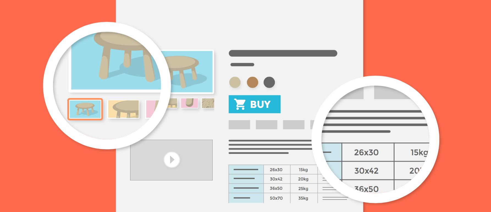

# Gérer le catalogue

La base d'une boutique PrestaShop est son catalogue, qui contient des produits et des catégories de produits. Construire et améliorer votre catalogue est la principale manière de faire vivre votre site aux yeux des clients. C'est ici que votre boutique prend forme, que vous créez effectivement du contenu, et donc que vous donnez de la valeur à votre boutique en ligne.

Ajouter des produits, ce n'est pas seulement coller une image, un peu de texte et valider votre contenu. Cela veut dire connaître votre produit par coeur : prix, poids, taille, caractéristiques, spécifications, détails, marque, fournisseurs, et tant d'autres choses. Vous ne pouvez pas vous lancer dans l'ajout d'un produit à votre catalogue sans savoir exactement ce que vous souhaitez présenter au client, et donc vous devez avoir une idée précise de ce qui compose vos produits, et la manière dont ces informations seront affichées dans le thème. Cela signifie également connaître parfaitement l'interface publique de votre boutique \(son thème\), afin de remplir tous les champs nécessaires dans votre back-office.

Le catalogue de votre boutique est accessible en cliquant sur la page "Produits" du menu "Catalogue". C'est ici que vous pourrez gérer tous vos produits.

Ce chapitre contient les sections suivantes :

* [Gérer les produits](gerer-produits.md)
* [Gérer les catégories](gerer-categories.md)
* [Faire le suivi de votre catalogue](faire-le-suivi-de-votre-catalogue.md)
* [Gérer les attributs de vos produits](gerer-attributs-produits.md)
* [Gérer les caractéristiques de vos produits](gerer-caracteristiques-produits.md)
* [Gérer les marques](gerer-marques.md)
* [Gérer les fournisseurs](gerer-fournisseurs.md)
* [Gérer les fichiers](gerer-fichiers.md)
* [Mettre en place des promotions](mettre-en-place-promotions/)
* [Gérez les stocks](gerer-stocks/)

